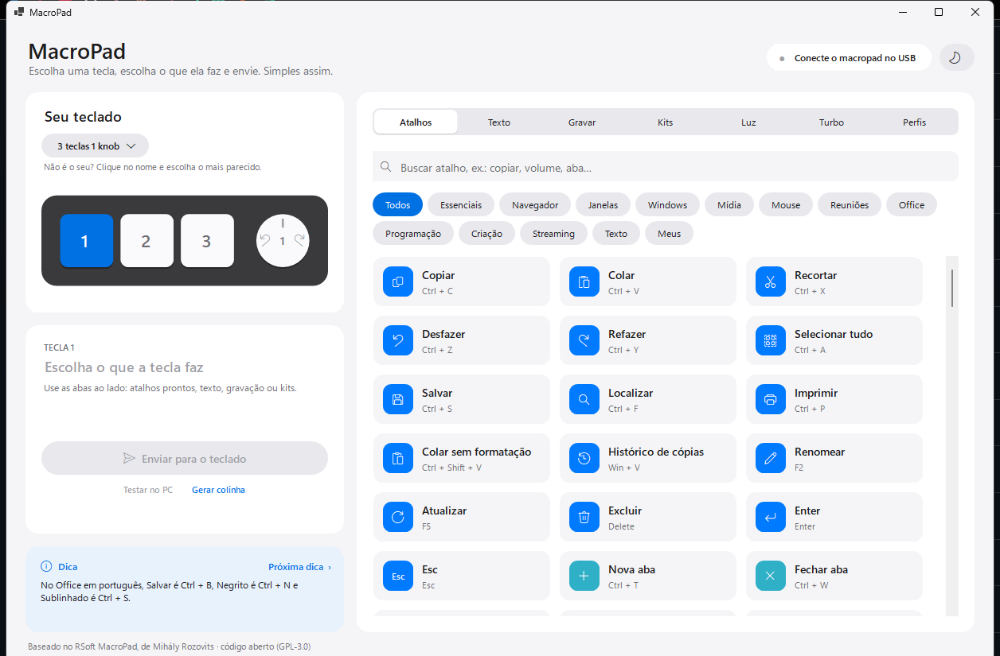
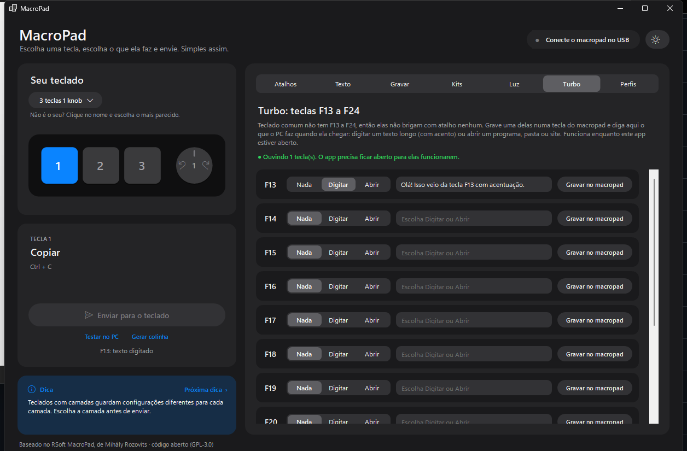

# MacroPad

App para configurar aqueles macropads USB chineses (teclas + knobs) sem depender do programa que vem na caixa.
Você clica numa tecla no desenho, escolhe o que ela faz e envia.

Esta é uma versão com interface refeita do [RSoft MacroPad](https://github.com/rOzzy1987/MacroPad), de Mihály Rozovits.
A parte que conversa com o teclado por USB é a dele; a interface, os atalhos prontos e as funções extras foram reescritos.



## O que dá para fazer

- **Atalhos prontos**: mais de 150, com busca e filtro por categoria (Essenciais, Navegador, Janelas, Windows, Mídia, Mouse, Reuniões, Office, Programação, Criação e Streaming).
- **Texto**: a tecla digita um texto sozinha. Bom para saudações e respostas repetidas.
- **Gravar**: aperte a combinação no seu teclado e ela vira a macro. Funciona em teclado ABNT2, porque o app usa a posição física da tecla.
- **Kits**: 7 conjuntos que configuram todas as teclas e knobs de uma vez (Música, Produtividade, Navegador, Teams, Janelas, OBS e VS Code).
- **Iluminação**: efeito e cor. Nos modelos com RGB por tecla (fabricante 514C) são 16 milhões de cores, branco
  incluso, e dá para **pintar cada tecla de uma cor** clicando nela no desenho.
- **Turbo (F13–F24)**: teclas que teclado comum não tem. Grave uma delas no macropad e o app faz o PC digitar um texto longo (com acento) ou abrir um programa, pasta ou site. Só funciona com o app aberto.
- **Perfis**: salve a configuração inteira com nome — teclas e iluminação —, aplique de novo com um clique, exporte, importe ou deixe um perfil entrar sozinho quando o teclado for conectado.
- **Colinha**: gera uma imagem com o desenho do teclado e o que cada tecla faz, para imprimir ou usar de papel de parede.
- **Tema claro e escuro**: segue o Windows e tem botão para trocar.



## Como rodar

Precisa do **.NET 8 SDK** para compilar e do **.NET 6 Desktop Runtime** para executar.

```bash
dotnet run --project src/RSoft.MacroPad      # abre o app
dotnet test src/RSoft.MacroPad.Tests         # roda os testes
dotnet build src/RSoft.MacroPad.sln -c Release
```

Não precisa instalar nada no Windows: o app é um executável solto que lê os arquivos de configuração da própria pasta.

## Como usar

1. Ligue o macropad no USB. O topo da janela mostra "Macropad conectado" e o modelo é detectado sozinho.
2. Se o modelo detectado não for o seu, clique no nome dele e escolha o mais parecido. O app lembra a escolha.
3. Clique numa tecla ou num knob no desenho. Em knob, o lado esquerdo é girar para a esquerda, o meio é apertar e o direito é girar para a direita.
4. Escolha a ação nas abas da direita.
5. Clique em **Enviar para o teclado**. O nome fica escrito na tecla do desenho.

Teclados com camadas guardam configurações diferentes em cada uma. Escolha a camada antes de enviar.

## Se o seu macropad não for reconhecido

O app só conversa com os aparelhos listados no `src/RSoft.MacroPad/config.txt`. Com o teclado ligado, ele procura
modelos parecidos e oferece **"Tentar assim mesmo"**, já salvando no arquivo. Para fazer na mão:

1. Descubra o ID no PowerShell:

   ```powershell
   Get-PnpDevice -PresentOnly | Where-Object { $_.InstanceId -match 'VID_' } | Select-Object FriendlyName, InstanceId
   ```

   Ligue e desligue o teclado para ver qual linha aparece e some. Anote `VID_XXXX` e `PID_YYYY` (estão em hexadecimal).

2. Converta para decimal e acrescente em `config.txt`:

   ```
   {VendorId}:{ProductId},mi_00,1
   ```

   O `mi_00` é a interface de configuração e o último número é o protocolo:

   | Número | Protocolo | Quem usa |
   |---|---|---|
   | `0` | antigo | o modelo de 3 teclas e 1 knob |
   | `1` | estendido | fabricante 1189 (`0x1189`) |
   | `2` | ch57x-3 | fabricante 514C (`0x514C`) |

   Se o fabricante for 514C, use `2`. Quando o app cadastra um teclado sozinho, ele já escolhe pelo fabricante.

3. Para o desenho ficar igual ao seu teclado, acrescente um layout em `src/RSoft.MacroPad/layouts.txt`. O formato
   está explicado no começo do arquivo.

Modelo testado de verdade, com envio e iluminação funcionando: `20812:34896` (`0x514C:0x8850`, 12 teclas e 2 knobs,
protocolo ch57x-3).

### Os três protocolos

São dialetos diferentes do mesmo tipo de teclado, e não dá para adivinhar qual é: depende do fabricante no USB.
O dialeto do fabricante 514C (`ch57x-3`) foi acrescentado nesta versão e não existia no projeto original — era por
isso que o app parecia enviar com sucesso, mas nada mudava no aparelho. Ele difere em tudo que importa:

- cabeçalho `0xFD` nas teclas, em vez de `0xFE`;
- modificador (Ctrl, Shift…) é um passo próprio (`0xF1`–`0xF8`), não um bit;
- 3 bytes por passo, e um report de encerramento `FD FE FF` sem o qual nada é guardado;
- knobs nos slots 16 a 21, três por knob, na ordem girar à esquerda, apertar, girar à direita;
- não tem ajuste de atraso entre as teclas, e não dá para ler de volta o que está gravado;
- iluminação em comando separado (`0xFE 0xB0`), com um trio RGB por tecla e um preâmbulo `FB FB FB` obrigatório —
  sem o preâmbulo o teclado aceita o comando e descarta sem avisar.

Os números dos knobs e o preâmbulo da luz foram conferidos no aparelho, tecla por tecla. A documentação pública
diz que os knobs começam no slot 17; neste modelo começam no 16.

## Arquivos que o app cria

Todos ficam na pasta do executável:

| Arquivo | Para quê |
|---|---|
| `assignments.json` | O que foi enviado para cada tecla, o último modelo escolhido e o tema. |
| `perfis/` | Um `.json` por perfil salvo. |
| `relay.json` | As ações das teclas F13 a F24. |
| `meus-atalhos.txt` | Seus atalhos escritos à mão (veja abaixo). |
| `colinhas/` | As imagens geradas. |
| `hid.log` e `error.log` | O que foi enviado ao teclado e os erros, para investigar problema. |

O macropad não consegue informar como ele está configurado. Os nomes nas teclas mostram só o que saiu deste PC.

## Seus próprios atalhos

O arquivo `meus-atalhos.txt` nasce com exemplos. Uma linha por atalho:

```
Paleta de comandos = Ctrl + Shift + P
Salvar tudo = Ctrl + K > S
Print da janela = Alt + Print Screen
```

O `>` separa combinações numa sequência. Linhas com `//` são comentário. Reabra o app e os atalhos aparecem na
categoria **Meus**. Linha que o app não entender é apontada na tela, sem derrubar as outras.

## Limites que vêm do hardware

- Cada macro guarda no máximo **18 teclas**; o modelo de 3 teclas guarda 5 e só aplica Ctrl/Shift na primeira delas.
- No protocolo ch57x-3 não existe atraso entre as teclas da macro, então o campo some da tela nesses modelos.
- O teclado não digita acento nem `ç`, e símbolos como `? ; : /` mudam de lugar conforme o layout do PC. Para texto
  com acento, use a aba Turbo, onde quem digita é o computador.
- O que o macropad manda é sempre o mesmo, esteja o app aberto ou não. A exceção é o Turbo, que depende do app rodando.
- Trocar a iluminação grava na memória do teclado, e cada troca leva de 70 a 170 ms (medido no `0x514C:0x8850`).
  Serve para escolher uma cor, não para fazer animação rápida — para efeito animado, use os efeitos do próprio
  teclado ("Ao toque", "Onda", "Arco-íris"), que rodam no firmware sem atraso.

## O que mudou em relação ao projeto original

Interface refeita, atalhos prontos, kits, perfis, Turbo, colinha, tema escuro e estes consertos, vindos das issues do projeto original:

- Gravar a tecla **Pause** salvava NumLock ([#43](https://github.com/rOzzy1987/MacroPad/issues/43)): as duas têm o mesmo
  código físico, e agora teclas iguais em todo layout valem pelo código virtual.
- O app quebrava ao conectar em alguns modelos ([#34](https://github.com/rOzzy1987/MacroPad/issues/34)): a escrita USB
  agora falha com aviso em vez de derrubar o programa.
- A janela não cabia em tela pequena ([#38](https://github.com/rOzzy1987/MacroPad/issues/38)).
- Teclado não reconhecido ([#36](https://github.com/rOzzy1987/MacroPad/issues/36) e
  [#37](https://github.com/rOzzy1987/MacroPad/issues/37)): o app agora encontra o aparelho e oferece cadastrá-lo.
- O `layouts.txt` tinha o fabricante trocado (4498 em vez de 4489) em 6 modelos, então eles nunca eram detectados.
- Qualquer macro de **mouse** derrubava o app: o mapeamento lia um atributo que os botões do mouse não têm.
  Valia para todos os modelos, em todos os protocolos.
- Os teclados do fabricante **514C** não eram suportados — o app enviava no dialeto errado e o teclado ignorava
  em silêncio. Foi acrescentado o dialeto `ch57x-3`, com teclas, mídia, mouse e iluminação RGB por tecla.

## Estrutura

```
src/
  RSoft.MacroPad/            App (WinForms): telas, desenho do teclado, gravação de atalhos
    Controls/                Componentes visuais e as abas
    Infrastructure/          Gancho de teclado, envio de teclas pelo PC, chamadas do Windows
  RSoft.MacroPad.BLL/        Regras e comunicação USB
    Macros/                  Catálogo de atalhos, kits, perfis, texto para teclas
    Infrasturture/           Protocolo do teclado e camada HID (do projeto original)
  RSoft.MacroPad.Tests/      Testes da parte que não depende de tela
```

## Licença

GPL-3.0, como o projeto original. Baseado no [RSoft MacroPad](https://github.com/rOzzy1987/MacroPad) de
Mihály Rozovits, que descobriu o protocolo destes teclados.
